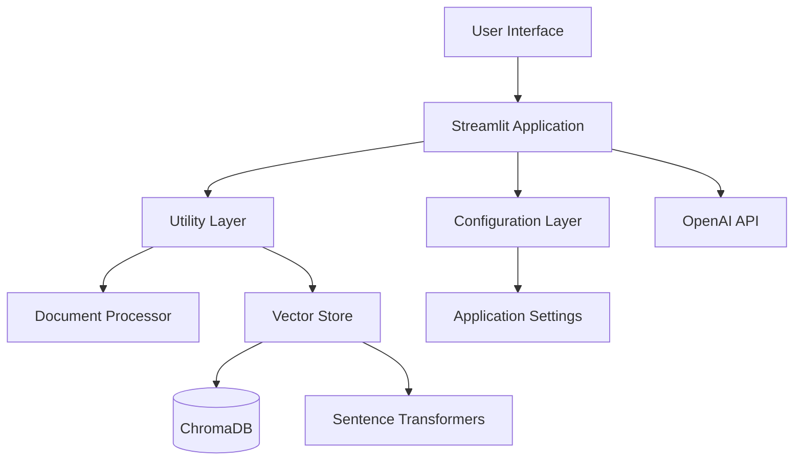

# Betty AI Assistant - Comprehensive Documentation

## Table of Contents
1. [Overview](#overview)
2. [Architecture](#architecture)
3. [Components](#components)
4. [Configuration](#configuration)
5. [API Reference](#api-reference)
6. [User Guide](#user-guide)
7. [Developer Guide](#developer-guide)
8. [Deployment](#deployment)
9. [Troubleshooting](#troubleshooting)

## Overview

Betty AI Assistant is a strategic transformation assistant built using Streamlit and OpenAI's GPT-4o, designed to support Outcome-Based Thinking (OBT), What/How Mapping, and cross-functional alignment for organizations.

### Key Features
- **RAG-Powered AI**: Retrieval-Augmented Generation with ChromaDB vector storage
- **Document Processing**: Support for PDF, DOCX, and TXT files
- **Strategic Coaching**: Built-in OBT methodology and strategic transformation support
- **Knowledge Base Management**: Persistent knowledge storage with automatic updates
- **Dual Interface**: Betty (specialized) and Generic Chat applications

### Technical Stack
- **Frontend**: Streamlit
- **AI Model**: OpenAI GPT-4o
- **Vector Database**: ChromaDB with Sentence Transformers
- **Document Processing**: PyPDF2, python-docx
- **Embeddings**: all-MiniLM-L6-v2 model

## Architecture

### System Architecture Diagram


### Component Hierarchy
```
betty_app.py (Main Betty Application)
├── config/
│   └── settings.py (Configuration Management)
├── utils/
│   ├── document_processor.py (Text Extraction & Processing)
│   └── vector_store.py (Vector Database Operations)
└── streamlit/
    └── chat/
        └── chat.py (Generic Chat Application)
```

## Components

### Core Applications

#### 1. Betty App (`betty_app.py`)
**Purpose**: Specialized strategic transformation assistant with pre-loaded knowledge base

**Key Features**:
- Strategic transformation support using OBT methodology
- Pre-configured with Molex-specific knowledge files
- Built-in coaching and educational capabilities
- Automatic RAG integration with permanent knowledge base

**System Prompt**: Contains comprehensive Betty 2.2 Beta personality with:
- Strategic transformation competencies
- OBT coaching capabilities
- Knowledge base architecture understanding
- Response standards and quality assurance

#### 2. Generic Chat App (`streamlit/chat/chat.py`)
**Purpose**: Flexible RAG-enabled chat interface for general document interaction

**Key Features**:
- Dynamic collection management
- File upload and processing
- Advanced configuration settings
- Multi-collection support

### Utility Components

#### 1. Document Processor (`utils/document_processor.py`)
**Purpose**: Unified document processing with robust error handling

**Capabilities**:
```python
class DocumentProcessor:
    def extract_text_from_pdf(file: io.BytesIO) -> str
    def extract_text_from_docx(file: io.BytesIO) -> str
    def extract_text_from_txt(file: io.BytesIO) -> str
    def clean_text(text: str) -> str
    def chunk_text(text: str, chunk_size: int, overlap: int) -> List[str]
    def get_file_type(filename: str) -> Optional[str]
    def process_uploaded_file(uploaded_file) -> str
```

**Features**:
- Multi-format support (PDF, DOCX, TXT)
- Token-based text chunking using tiktoken
- Automatic text cleaning and normalization
- File size validation and error handling
- Encoding detection for text files

#### 2. Vector Store (`utils/vector_store.py`)
**Purpose**: High-level ChromaDB interface with configuration management

**Capabilities**:
```python
class VectorStore:
    def get_or_create_collection(collection_name: str)
    def add_documents_from_files(collection_name: str, file_paths: List[str]) -> bool
    def search_collection(collection_name: str, query: str, n_results: int) -> List[Dict]
    def list_collections() -> List[str]
    def delete_collection(collection_name: str) -> bool
```

**Features**:
- Persistent ChromaDB client management
- Automatic embedding generation with SentenceTransformer
- Duplicate file detection and prevention
- Progress tracking and error handling
- Batch document processing

#### 3. Configuration (`config/settings.py`)
**Purpose**: Centralized configuration management for different deployment scenarios

**Configuration Classes**:
- `AppConfig`: Betty-specific settings
- `ChatConfig`: Generic chat app settings

## Configuration

### Environment Variables
```bash
# Required
OPENAI_API_KEY=your_openai_api_key

# Optional Database Configuration
CHROMA_DB_PATH=./betty_chroma_db
CHAT_CHROMA_DB_PATH=./chroma_db

# Optional Processing Configuration
CHUNK_SIZE=500
CHUNK_OVERLAP=50
MAX_SEARCH_RESULTS=3
MAX_FILE_SIZE_MB=10

# Optional Model Configuration
EMBEDDING_MODEL=all-MiniLM-L6-v2
TOKENIZER_MODEL=cl100k_base
OPENAI_MODEL=gpt-4o
```

### Betty App Configuration (`AppConfig`)
```python
# API Configuration
OPENAI_API_KEY: Optional[str] = None
OPENAI_MODEL: str = "gpt-4o"

# Database Configuration
CHROMA_DB_PATH: str = "./betty_chroma_db"

# Processing Configuration
CHUNK_SIZE: int = 500
CHUNK_OVERLAP: int = 50
MAX_SEARCH_RESULTS: int = 3

# Knowledge Base
KNOWLEDGE_COLLECTION_NAME: str = "betty_knowledge"
DEFAULT_KNOWLEDGE_FILES: tuple = (
    "Betty for Molex GPS.docx",
    "Molex Manufacturing BA Reference Architecture.docx"
)
```

### Chat App Configuration (`ChatConfig`)
```python
CHROMA_DB_PATH: str = "./chroma_db"
PAGE_TITLE: str = "GPT-4o RAG Chat App"

# Advanced Settings
DEFAULT_CHUNK_SIZE: int = 500
DEFAULT_OVERLAP: int = 50
DEFAULT_N_RESULTS: int = 3
DEFAULT_TEMPERATURE: float = 0.7
```

## API Reference

### Document Processor API

#### Text Extraction Methods
```python
# PDF Processing
extract_text_from_pdf(file: io.BytesIO) -> str
"""Extract text from PDF with page-by-page error handling"""

# DOCX Processing
extract_text_from_docx(file: io.BytesIO) -> str
"""Extract text from DOCX paragraphs with error handling"""

# Text Processing
extract_text_from_txt(file: io.BytesIO) -> str
"""Extract text with UTF-8/Latin-1 encoding detection"""
```

#### Text Processing Methods
```python
# Text Cleaning
clean_text(text: str) -> str
"""Normalize spacing, line breaks, and formatting"""

# Text Chunking
chunk_text(text: str, chunk_size: int = 500, overlap: int = 50) -> List[str]
"""Token-based chunking with configurable overlap"""

# File Type Detection
get_file_type(filename: str) -> Optional[str]
"""Return 'pdf', 'docx', 'txt', or None"""
```

### Vector Store API

#### Collection Management
```python
# Collection Operations
get_or_create_collection(collection_name: str) -> Collection
"""Get existing or create new ChromaDB collection"""

list_collections() -> List[str]
"""List all available collection names"""

delete_collection(collection_name: str) -> bool
"""Delete collection and return success status"""
```

#### Document Operations
```python
# Document Addition
add_documents_from_files(
    collection_name: str, 
    file_paths: List[str], 
    show_progress: bool = True
) -> bool
"""Process files and add to collection with duplicate prevention"""

# Document Search
search_collection(
    collection_name: str, 
    query: str, 
    n_results: int = 3
) -> List[Dict[str, Any]]
"""Semantic search returning content and metadata"""
```

### Configuration API

#### Validation Methods
```python
# AppConfig Validation
AppConfig.validate_config() -> bool
"""Validate API key, chunk sizes, and overlap settings"""

# Environment Initialization
AppConfig.init_environment()
"""Set environment variables and disable tokenizer parallelism"""
```

## User Guide

### Getting Started

#### Prerequisites
1. Python 3.8+
2. OpenAI API key
3. Required dependencies (see requirements.txt)

#### Installation
```bash
# Clone repository
git clone <repository-url>
cd betty-ai-assistant

# Install dependencies
pip install -r requirements.txt

# Set environment variables
export OPENAI_API_KEY="your_api_key_here"

# Run Betty App
streamlit run betty_app.py

# Or run Generic Chat App
streamlit run streamlit/chat/chat.py
```

#### First Time Setup
1. **Betty App**: Knowledge base automatically loads on first run
2. **Chat App**: Upload documents to create your first collection

### Using Betty App

#### Main Interface
- **Chat Input**: Ask Betty about strategic transformation, OBT methodology, or specific questions
- **File Upload**: Upload temporary documents for context (PDF, DOCX, TXT up to 10MB)
- **Knowledge Toggle**: Enable/disable RAG (Retrieval-Augmented Generation)
- **Update Knowledge**: Refresh knowledge base with new files

#### Betty's Capabilities
1. **Strategic Transformation**: Outcome-based thinking, What/How mapping, GPS tier mapping
2. **Instructional Coaching**: Educational responses for OBT methodology
3. **Knowledge Integration**: Access to Molex-specific documentation
4. **Quality Assurance**: Built-in validation for outcome statements and KPIs

#### Example Interactions
```
User: "We want to improve our product development process"

Betty: I'll help transform this into a measurable strategic outcome.

**Generated Outcome**: "Product development cycle time reduced 30%" (9 words)
- **Classification**: What (end result)
- **GPS Tier**: Main Street (operational improvement)
- **KPI Recommendation**:
  - Goal: Reduce development cycle time by 30%
  - Measurement: Average days from concept to market launch
```

### Using Generic Chat App

#### Collection Management
1. **Create Collection**: Enter new collection name and upload documents
2. **Select Collection**: Choose active collection from dropdown
3. **Add Documents**: Upload additional files to existing collections
4. **Delete Collection**: Remove collections and all associated data

#### Advanced Settings
- **Chunk Size**: 200-1000 tokens (default: 500)
- **Chunk Overlap**: 0-200 tokens (default: 50)
- **Retrieved Documents**: 1-10 results (default: 3)
- **Temperature**: 0.0-1.0 creativity (default: 0.7)

## Developer Guide

### Project Structure
```
├── betty_app.py              # Main Betty application
├── config/
│   ├── __init__.py
│   └── settings.py           # Configuration classes
├── utils/
│   ├── __init__.py
│   ├── document_processor.py # Text processing utilities
│   └── vector_store.py       # ChromaDB interface
├── streamlit/
│   ├── chat/
│   │   └── chat.py          # Generic chat application
│   └── requirements.txt      # Streamlit-specific dependencies
├── requirements.txt          # Main dependencies
├── betty_chroma_db/         # Betty's vector database
├── chroma_db/               # Chat app vector database
└── knowledge_files/         # Default knowledge documents
```

### Architecture Patterns

#### Configuration Pattern
- Centralized configuration with environment variable support
- Separate configuration classes for different applications
- Validation methods for critical settings

#### Error Handling Pattern
```python
try:
    # Core operation
    result = risky_operation()
    return result
except SpecificException as e:
    st.error(f"Specific error message: {e}")
    return fallback_value
except Exception as e:
    st.error(f"General error occurred: {e}")
    raise
```

#### Resource Management Pattern
```python
@st.cache_resource
def init_expensive_resource():
    """Initialize resource once per session"""
    return ExpensiveResource()

# Global instance pattern
global_instance = ResourceClass()
```

### Extending the Application

#### Adding New Document Types
1. **Update DocumentProcessor**:
```python
def extract_text_from_new_format(self, file: io.BytesIO) -> str:
    """Extract text from new format"""
    # Implementation here
    pass

def get_file_type(self, filename: str) -> Optional[str]:
    """Add new format detection"""
    if filename_lower.endswith('.new_ext'):
        return 'new_format'
    # ... existing code
```

2. **Update Configuration**:
```python
SUPPORTED_FILE_TYPES: tuple = (".pdf", ".docx", ".txt", ".new_ext")
```

#### Creating New Applications
1. Create new application file
2. Import shared utilities from `utils/`
3. Configure application-specific settings
4. Follow established patterns for error handling and resource management

### Testing Strategy

#### Unit Testing
```python
# Test document processing
def test_document_processor():
    processor = DocumentProcessor()
    # Test extraction methods
    # Test chunking logic
    # Test error handling

# Test vector store operations
def test_vector_store():
    store = VectorStore()
    # Test collection operations
    # Test search functionality
    # Test error scenarios
```

#### Integration Testing
- Test complete RAG workflow
- Test file upload and processing
- Test knowledge base refresh
- Test multi-collection scenarios

## Deployment

### Local Development
```bash
# Install dependencies
pip install -r requirements.txt

# Set environment variables
export OPENAI_API_KEY="your_key"

# Run locally
streamlit run betty_app.py --server.port 8501
```

### Streamlit Cloud Deployment

#### Prerequisites
1. GitHub repository with code
2. Streamlit Cloud account
3. OpenAI API key

#### Deployment Steps
1. **Connect Repository**: Link GitHub repository to Streamlit Cloud
2. **Configure Secrets**: Add `OPENAI_API_KEY` in Streamlit Cloud secrets
3. **Set Main File**: Specify `betty_app.py` or `streamlit/chat/chat.py`
4. **Deploy**: Application automatically deploys on code changes

#### SQLite Compatibility Fix
The application includes a workaround for ChromaDB/SQLite compatibility on Streamlit Cloud:

```python
try:
    import sys
    import importlib
    pysqlite3 = importlib.import_module('pysqlite3')
    sys.modules['sqlite3'] = pysqlite3
except ModuleNotFoundError:
    pass  # Fallback to default sqlite3
```

### Docker Deployment
```dockerfile
FROM python:3.9-slim

WORKDIR /app
COPY requirements.txt .
RUN pip install -r requirements.txt

COPY . .

EXPOSE 8501

CMD ["streamlit", "run", "betty_app.py", "--server.address", "0.0.0.0"]
```

### Environment Configuration
```bash
# Production environment variables
OPENAI_API_KEY=your_production_key
CHROMA_DB_PATH=/app/data/betty_chroma_db
CHUNK_SIZE=500
MAX_FILE_SIZE_MB=50
```

## Troubleshooting

### Common Issues

#### 1. OpenAI API Key Issues
**Symptoms**: "Please set your OpenAI API key" error
**Solutions**:
- Verify API key is set in environment variables
- Check Streamlit Cloud secrets configuration
- Ensure API key has sufficient credits

#### 2. ChromaDB Connection Issues
**Symptoms**: "Could not connect to ChromaDB" error
**Solutions**:
- Check database path permissions
- Verify SQLite compatibility fix is in place
- Clear corrupted database: `rm -rf betty_chroma_db/`

#### 3. File Processing Issues
**Symptoms**: "No text could be extracted" warnings
**Solutions**:
- Verify file format is supported (PDF, DOCX, TXT)
- Check file size limits (default 10MB)
- Ensure files are not corrupted or password-protected

#### 4. Memory Issues
**Symptoms**: Application crashes during large file processing
**Solutions**:
- Reduce chunk size in configuration
- Process files in smaller batches
- Increase system memory allocation

#### 5. Embedding Generation Issues
**Symptoms**: Slow response times, timeout errors
**Solutions**:
- Check internet connectivity for model downloads
- Verify SentenceTransformer model cache
- Reduce batch size for embedding generation

### Performance Optimization

#### 1. Chunk Size Tuning
- **Small chunks (200-400)**: Better precision, more storage
- **Large chunks (600-1000)**: Better context, less storage
- **Optimal range**: 400-600 tokens for most use cases

#### 2. Search Result Optimization
- **Fewer results (1-3)**: Faster, focused responses
- **More results (5-10)**: Comprehensive, slower responses
- **Optimal range**: 3-5 results for balanced performance

#### 3. Caching Strategies
- Use `@st.cache_resource` for expensive initializations
- Cache embeddings for frequently searched documents
- Implement session-based caching for user interactions

### Debugging Tips

#### 1. Enable Debug Mode
```python
import logging
logging.basicConfig(level=logging.DEBUG)
```

#### 2. Check Database Contents
```python
# List collections
collections = vector_store.list_collections()
print(f"Available collections: {collections}")

# Check collection size
collection = vector_store.get_or_create_collection("collection_name")
print(f"Document count: {collection.count()}")
```

#### 3. Test Document Processing
```python
# Test individual components
processor = DocumentProcessor()
text = processor.extract_text_from_pdf(file_bytes)
chunks = processor.chunk_text(text)
print(f"Extracted {len(chunks)} chunks")
```

## Maintenance

### Regular Maintenance Tasks

#### 1. Knowledge Base Updates
- Review and update knowledge files quarterly
- Use "Update Knowledge Base" button to refresh content
- Monitor storage usage and clean up unused collections

#### 2. Dependency Updates
- Update Python packages monthly
- Test compatibility with new OpenAI API versions
- Monitor ChromaDB and Streamlit updates

#### 3. Performance Monitoring
- Monitor API usage and costs
- Track application response times
- Review error logs and user feedback

#### 4. Security Updates
- Rotate OpenAI API keys annually
- Review access controls and permissions
- Update security-related dependencies promptly

### Backup and Recovery

#### 1. Database Backup
```bash
# Backup ChromaDB
tar -czf betty_backup_$(date +%Y%m%d).tar.gz betty_chroma_db/

# Restore from backup
tar -xzf betty_backup_20240101.tar.gz
```

#### 2. Configuration Backup
- Document environment variables
- Export Streamlit Cloud secrets
- Maintain configuration templates

#### 3. Knowledge File Versioning
- Use version control for knowledge files
- Maintain change logs for content updates
- Test knowledge base integrity after updates

---

## Support and Contributing

### Getting Help
- Check troubleshooting section above
- Review error logs and debug output
- Contact development team with specific error messages

### Contributing
- Follow established code patterns
- Add comprehensive error handling
- Update documentation for new features
- Test thoroughly before submitting changes

### Version History
- **v2.2 Beta**: Current version with OBT methodology
- **v2.1**: Enhanced RAG capabilities
- **v2.0**: Streamlit-based architecture
- **v1.x**: Initial implementations

---

*Documentation last updated: January 2025*