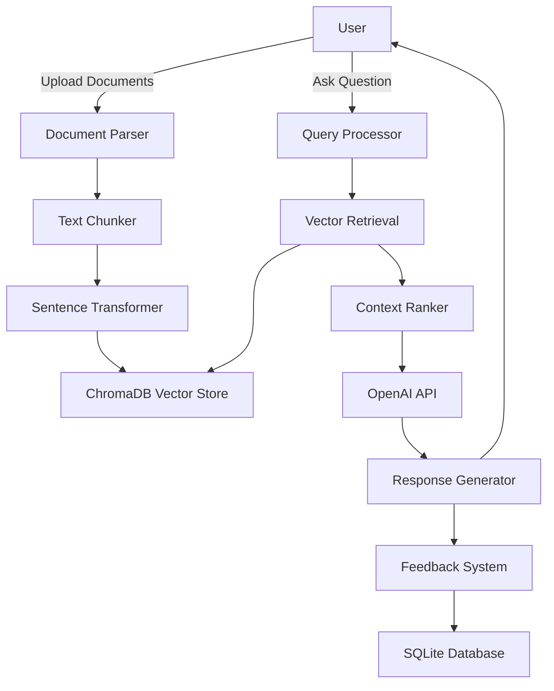

# RAG Chat Application 🤖💬

An intelligent document-based chat application powered by Retrieval-Augmented Generation (RAG). Upload your documents and have natural conversations with their content using advanced AI.


## 🌟 Overview

This RAG Chat Application enables users to upload documents and engage in intelligent conversations about their content. The system combines document retrieval with AI-generated responses to provide accurate, contextually relevant answers based on your uploaded documents.

## ✨ Key Features

### 📄 Smart Document Processing
- **Multi-format Support**: PDF, TXT, and DOCX document upload
- **Intelligent Chunking**: Automatic text segmentation for optimal retrieval
- **Metadata Extraction**: Document titles, creation dates, and content analysis

### 🔍 Advanced Retrieval System
- **Semantic Search**: ChromaDB vector database with sentence-transformer embeddings
- **Similarity Matching**: Configurable similarity thresholds for precise retrieval
- **Context Ranking**: Intelligent ranking of relevant document segments

### 🤖 AI-Powered Conversations
- **OpenAI Integration**: GPT-3.5 and GPT-4 model support
- **Contextual Responses**: AI answers grounded in your document content
- **Conversation Memory**: Maintains context across chat sessions

### 💻 User-Friendly Interface
- **Clean Design**: Modern Streamlit-based web interface
- **Real-time Chat**: Instant responses with typing indicators
- **Document Management**: Easy upload and organization
- **Mobile Responsive**: Works seamlessly on all devices

### 📊 Feedback & Analytics
- **Response Rating**: Thumbs up/down feedback system
- **Quality Tracking**: Monitor AI response accuracy
- **Usage Analytics**: Document and query statistics

## 🏗️ Architecture



## 📁 Project Structure

```
rag-chat/
├── 📄 chat.py                    # Main Streamlit application
├── 📋 requirements.txt           # Python dependencies
├── 🔧 .gitignore                # Git ignore rules
├── 📖 README.md                 # This file
├── 🔐 .streamlit/
│   └── secrets.example.toml     # API key template
├── ⚙️ config/
│   ├── __init__.py
│   └── settings.py              # Application configuration
├── 🧠 rag/
│   ├── __init__.py
│   ├── chunker.py               # Document chunking logic
│   ├── retriever.py             # Document retrieval system
│   └── vector_store.py          # ChromaDB integration
├── 🛠️ utils/
│   ├── __init__.py
│   └── document_parser.py       # Multi-format document parsing
├── 💾 storage/
│   ├── chroma_db/               # Vector database files
│   └── documents/               # Processed document storage
├── 📊 data/
│   └── feedback.db              # User feedback database
└── 🧪 test_rag_system.py        # System tests
```

## 🚀 Quick Start

### Prerequisites
- **Python 3.8+** installed on your system
- **OpenAI API Key** ([Get one here](https://platform.openai.com/api-keys))

### Installation

1. **Clone the repository**
```bash
git clone https://github.com/tonybegum67/rag-chat.git
cd rag-chat
```

2. **Create virtual environment** (recommended)
```bash
python -m venv venv

# On Windows
venv\Scripts\activate

# On macOS/Linux
source venv/bin/activate
```

3. **Install dependencies**
```bash
pip install -r requirements.txt
```

4. **Configure your API key**
```bash
# Copy the example secrets file
cp .streamlit/secrets.example.toml .streamlit/secrets.toml

# Edit the file and add your OpenAI API key
# OPENAI_API_KEY = "your-api-key-here"
```

### Launch the Application

```bash
streamlit run chat.py
```

The application will open in your default browser at `http://localhost:8501`

## 📖 How to Use

1. **📤 Upload Documents**
   - Use the sidebar to upload PDF, TXT, or DOCX files
   - Documents are automatically processed and stored

2. **💬 Start Chatting**
   - Type your questions in the chat input
   - Ask about specific topics, request summaries, or seek clarifications

3. **👍 Provide Feedback**
   - Rate responses with thumbs up/down
   - Help improve the system's accuracy

4. **🔍 Explore Features**
   - View document summaries
   - Check processing status
   - Monitor system performance

## ⚙️ Configuration

Customize the application by editing `config/settings.py`:

### AI Model Settings
```python
# OpenAI Configuration
OPENAI_MODEL = "gpt-3.5-turbo"  # or "gpt-4"
TEMPERATURE = 0.7
MAX_TOKENS = 1000
```

### Document Processing
```python
# Chunking Parameters
CHUNK_SIZE = 1000
CHUNK_OVERLAP = 200
MAX_CHUNKS_PER_DOC = 100
```

### Vector Store Settings
```python
# ChromaDB Configuration
COLLECTION_NAME = "document_chunks"
SIMILARITY_THRESHOLD = 0.7
MAX_RESULTS = 5
```

## 🔧 Advanced Features

### Custom Embedding Models
Replace the default sentence-transformer model:
```python
EMBEDDING_MODEL = "all-MiniLM-L6-v2"  # Default
# Or use: "all-mpnet-base-v2" for higher accuracy
```

### Database Management
Access the feedback database:
```python
import sqlite3
conn = sqlite3.connect('data/feedback.db')
# Query feedback data
```

### Batch Document Processing
For large document collections:
```bash
python -c "from utils.document_parser import batch_process; batch_process('path/to/docs')"
```

## 📦 Dependencies

### Core Libraries
| Package | Version | Purpose |
|---------|---------|---------|
| `streamlit` | Latest | Web application framework |
| `openai` | Latest | AI model integration |
| `chromadb` | 0.4.18 | Vector database |
| `sentence-transformers` | Latest | Text embeddings |
| `tiktoken` | Latest | Token counting |

### Document Processing
| Package | Version | Purpose |
|---------|---------|---------|
| `PyPDF2` | Latest | PDF parsing |
| `python-docx` | Latest | Word document processing |

### System Compatibility
| Package | Version | Purpose |
|---------|---------|---------|
| `pysqlite3-binary` | Latest | Cloud deployment support |
| `streamlit-mermaid` | Latest | System diagrams (optional) |

## 🚀 Deployment Options

### Streamlit Cloud (Recommended)
1. Fork this repository on GitHub
2. Sign up at [Streamlit Cloud](https://streamlit.io/cloud)
3. Connect your GitHub account
4. Deploy from your forked repository
5. Add `OPENAI_API_KEY` in Streamlit Cloud secrets

### Heroku Deployment
```bash
# Create Procfile
echo "web: streamlit run chat.py --server.port $PORT" > Procfile

# Deploy to Heroku
heroku create your-app-name
heroku config:set OPENAI_API_KEY=your-key-here
git push heroku main
```

### Docker Deployment
```dockerfile
FROM python:3.9-slim

WORKDIR /app
COPY requirements.txt .
RUN pip install -r requirements.txt

COPY . .
EXPOSE 8501

CMD ["streamlit", "run", "chat.py"]
```

## 🧪 Testing

Run the test suite:
```bash
python test_rag_system.py
```

Test individual components:
```bash
# Test document parsing
python -m utils.document_parser

# Test vector store
python -m rag.vector_store

# Test retrieval system
python -m rag.retriever
```

## 🔍 Troubleshooting

### Common Issues

**"No module named 'chromadb'"**
```bash
pip install --upgrade chromadb==0.4.18
```

**"OpenAI API key not found"**
- Verify `.streamlit/secrets.toml` exists
- Check API key format and permissions

**"SQLite version error"**
```bash
pip install --upgrade pysqlite3-binary
```

**"Memory error during document processing"**
- Reduce `CHUNK_SIZE` in settings
- Process smaller documents first
- Increase system memory allocation

### Performance Optimization

**Faster document processing:**
- Use smaller chunk sizes
- Enable document caching
- Optimize embedding model choice

**Improved response quality:**
- Increase similarity threshold
- Use GPT-4 for complex queries
- Fine-tune chunking parameters

## 🤝 Contributing

We welcome contributions! Here's how to get started:

### Development Setup
```bash
git clone https://github.com/tonybegum67/rag-chat.git
cd rag-chat
python -m venv dev-env
source dev-env/bin/activate  # or dev-env\Scripts\activate on Windows
pip install -r requirements.txt
pip install -e .
```

### Contribution Process
1. 🍴 Fork the repository
2. 🌿 Create a feature branch: `git checkout -b feature/amazing-feature`
3. ✍️ Make your changes with tests
4. ✅ Ensure tests pass: `python test_rag_system.py`
5. 📝 Commit changes: `git commit -m 'Add amazing feature'`
6. 📤 Push to branch: `git push origin feature/amazing-feature`
7. 🔄 Create a Pull Request

### Code Style
- Follow PEP 8 guidelines
- Use type hints where applicable
- Add docstrings for new functions
- Include tests for new features

## 📝 License

This project is licensed under the MIT License - see the [LICENSE](LICENSE) file for details.

## 🆘 Support & Community

- 🐛 **Bug Reports**: [Create an issue](https://github.com/tonybegum67/rag-chat/issues)
- 💬 **Discussions**: [Join the conversation](https://github.com/tonybegum67/rag-chat/discussions)
- 📧 **Email Support**: Available for enterprise users
- 📖 **Documentation**: Check the wiki for detailed guides

## 🎯 Roadmap

### Version 2.0 (Q2 2024)
- [ ] 🌐 Multi-language document support (Spanish, French, German)
- [ ] 📊 Advanced analytics dashboard
- [ ] 🔄 Real-time collaboration features
- [ ] 🔌 Plugin system for custom processors

### Version 2.1
- [ ] 🎨 Custom UI themes
- [ ] 📱 Mobile app companion
- [ ] 🤖 Multiple AI provider support (Anthropic, Cohere)
- [ ] 🔐 Enhanced security features

### Future Considerations
- [ ] 📈 Enterprise scaling features
- [ ] 🔍 Advanced search operators
- [ ] 📝 Document annotation tools
- [ ] 🌊 Streaming responses
- [ ] 🎯 Custom training capabilities

## 🏆 Acknowledgments

- **OpenAI** for providing excellent language models
- **ChromaDB** team for the vector database solution
- **Streamlit** for the amazing web framework
- **Hugging Face** for sentence transformers
- **Contributors** who help improve this project

## 📊 Project Stats


---

<div align="center">

**Made with ❤️ for the AI community**

[⭐ Star this project](https://github.com/tonybegum67/rag-chat/stargazers) | [🍴 Fork it](https://github.com/tonybegum67/rag-chat/fork) | [📢 Share it](https://twitter.com/intent/tweet?text=Check%20out%20this%20amazing%20RAG%20Chat%20Application!&url=https://github.com/tonybegum67/rag-chat)

</div>